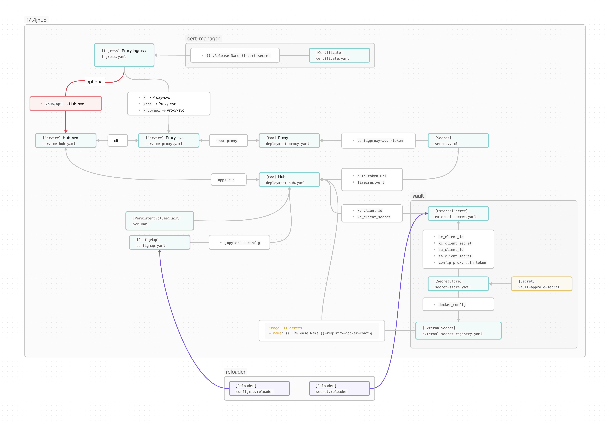
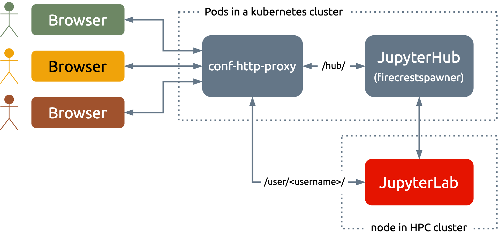

Deployment
==========

Overview
--------

Deploying JupyteHub has two components:

Hub and proxy
  Users access the hub (JupyterHub), which is a multi-user platform from where Jupyter notebook servers are launched.
  When using FirecRESTSpawner, notebook servers are started via FirecREST on the compute nodes of HPC clusters.
  The proxy routes the communication from the user's browser to the hub or to the notebook servers.
  Besides access to the internet and to the FirecREST server, no special requirements are necessary for the platforms running the hub and the proxy.

Jupyter notebook servers
  Jupyter notebook servers (also known as single-user servers) are dynamically created and terminated as users spawn or stop them.
  JupyterLab and other necessary packages must be installed on the HPC cluster since they will be running on compute nodes.
  That can be done either natively or as a container image.
  This part of the deployment doesn't require FirecREST.

Reference deployment at CSCS
----------------------------

At the Swiss National Supercomputing Centre (CSCS), JupyterHub is deployed on Kubernetes.
From there, JupyterLab servers are launched on different HPC clusters via FirecREST.
Each deployment targets a single cluster.

JupyterHub is deployed on ArgoCD using the `f7t4jhub <https://eth-cscs.github.io/firecrestspawner>`_ Helm chart.
The chart is available in the `spawner's repository <https://github.com/eth-cscs/firecrestspawner/tree/main/chart>`_.
It has been designed mainly for CSCS but it's general enough for the use at other sites.

   Schematic representation of the f7t4jhub chart

In our deployments at CSCS, the hub and proxy run on their own pods.
That's a standard practice that allows the hub to be restarted (to apply a new configuration, for instance) without affecting users with running JupyterLab servers.
The deployment used the following images:

Proxy
  JupyterHub's default `configurable-http-proxy <https://github.com/jupyterhub/configurable-http-proxy>`_ is used as a proxy.
  We package it in the container image `ghcr.io/eth-cscs/chp <https://github.com/eth-cscs/firecrestspawner/pkgs/container/chp>`_.
  Initially we used ``quay.io/jupyterhub/configurable-http-proxy:4.6.1``, but because of security reasons we now build our own image that uses the newer ``node:lts-alpine3.19`` as base.

Hub
  For the hub, we use our container image ``ghcr.io/eth-cscs/f7t4jhub``, which includes JupyterHub and FirecRESTSpawner.
  The corresponding Dockerfile can be found `here <https://github.com/eth-cscs/firecrestspawner/blob/main/dockerfiles/Dockerfile>`_.

The following figure shows a schematic representation of the deployment:

   JupyterHub deployment at CSCS

Access to Keycloak
~~~~~~~~~~~~~~~~~~

At CSCS, the Keycloak client's IDs and secrets to login in JupyterHub are stored in `Vault <https://www.vaultproject.io>`_.
They can be accessed in our kubernetes deployment via a set of secrets:

- The ``vault-approle-secret`` kubernetes ``Secret``, which contains the credentials to access Vault.
  This secret is not part of the helm chart. It must be created manually for the namespace where the chart will be deployed.

- A `SecretStore <https://github.com/eth-cscs/firecrestspawner/blob/main/chart/f7t4jhub/templates/secret-store.yaml>`_, which interacts with the ``vault-approle-secret`` secret.

- An `ExternalSecret <https://github.com/eth-cscs/firecrestspawner/blob/main/chart/f7t4jhub/templates/external-secret.yaml>`_ which interacts with the ``SecretStore`` allowing the deployment to access the client's IDs and secrets.

- An optional `ExternalSecret to access credentials for a custom container registry <https://github.com/eth-cscs/firecrestspawner/blob/main/chart/f7t4jhub/templates/external-secret-registry.yaml>`_. That's currently not in use.

The section of the chart related to Vault is optional and can be disabled in the ``values.yaml``.

JupyterHub configuration
~~~~~~~~~~~~~~~~~~~~~~~~

Another key element of the chart is the ``ConfigMap`` mentioned above, which provides
the `JupyterHub configuration <https://jupyterhub.readthedocs.io/en/stable/tutorial/getting-started/config-basics.html>`_.
While the configuration includes many parameters, only a handful need to be modified from one deployment to another.
Therefore, templating only those parameters seems to be sufficient to create a generic chart for all CSCS deployments,
requiring only minor adjustments in the ``values.yaml``.
In our deployments, the required changes are typically related to the authentication settings and the batch script used by the spawner
to submit the Jupyter notebook servers, as Slurm settings may vary between clusters.
All JupyterHub configuration parameters are set under ``config`` in the ``values.yaml``.

Live updates
~~~~~~~~~~~~

The chart uses `Reloader <https://github.com/stakater/Reloader>`_ to ensure that the hub pod is restarted if the configuration is modified or if secrets are changed in vault.
Since the hub and the proxy run on different pods, plus the JupyterHub database is stored on a persistent volume, it's possible to apply new configurations without affecting users that have JupyterLab running.

HTTPS Provisioning
~~~~~~~~~~~~~~~~~~

HTTPS is automatically provided by `cert-manager <https://cert-manager.io/>`_, which handles the management of of SSL/TLS certificates to ensure secure connections.

Deploying the chart
~~~~~~~~~~~~~~~~~~~

This section explain how the chart is deployed with Helm or ArgoCD.
For either option, there's a common first first step, which is the  creation of the ``vault-approle-secret``.
That can be done in a namespace with the following command:

.. code-block:: Shell

   kubectl create namespace <namespace>
   kubectl create secret generic vault-approle-secret --from-literal secret-id=<approle-secret-id> -n<namespace> 

Here  ``secret-id=<approle-secret-id>`` is a "key, value" pair.
The actual value of ``<approle-secret-id>`` can be copied from an existing ``vault-approle-secret``.

.. code-block:: Shell

   kubectl get secret vault-approle-secret -n<existing-namespace> -o yaml
   # apiVersion: v1
   # data:
   #   secret-id: <approle-secret-id-base64>
   # kind: Secret
   # metadata:
   #   creationTimestamp: "2024-03-06T16:22:23Z"
   #   name: vault-approle-secret
   #   namespace: jhub-clariden-tds
   #   resourceVersion: "206319585"
   #   uid: 29490228-a546-4609-bba3-102dc9b113b9
   # type: Opaque

In the output, ``<approle-secret-id-base64>`` is the ``<approle-secret-id>`` encoded as Base64. It must be decoded in order to use it with the ``kubectl create secret``.

In short

.. code-block:: Shell

   kubectl get secret vault-approle-secret -njhub-eiger-dev -o jsonpath="{.data.secret-id}" | base64 --decode

Helm
^^^^

The repository can be added to the local helm repo with

.. code-block:: Shell

    helm repo add f7t4jhub https://eth-cscs.github.io/firecrestspawner
    helm repo update

Now, for instance the available versions can be displayed

.. code-block:: Shell

    helm search repo f7t4jhub/f7t4jhub --versions
    # NAME             	CHART VERSION	APP VERSION	DESCRIPTION
    # f7t4jhub/f7t4jhub	0.6.0        	4.1.5      	A Helm chart to Deploy JupyterHub with the Fire...
    # f7t4jhub/f7t4jhub	0.5.2        	4.1.5      	A Helm chart to Deploy JupyterHub with the Fire...
    # f7t4jhub/f7t4jhub	0.5.1        	4.1.5      	A Helm chart to Deploy JupyterHub with the Fire...
    # f7t4jhub/f7t4jhub	0.5.0        	4.1.5      	A Helm chart to Deploy JupyterHub with the Fire...
    # f7t4jhub/f7t4jhub	0.3.0        	4.1.5      	A Helm chart to Deploy JupyterHub with the Fire...

Once available locally, the chart can be installed with

.. code-block:: Shell

   helm dependency build
   helm install <namespace> -n<namespace> f7t4jhub/f7t4jhub --values values.yaml --version <chart-version>

and updated live with

.. code-block:: Shell

   helm dependency build
   helm upgrade namespace -n<namespace> f7t4jhub/f7t4jhub --values values.yaml

Here we have used the same names for the namespace and the helm release.

ArgoCD
^^^^^^

The ``values.yaml`` as presented in the spawner's repository, is written for a deployment with Helm.
To deploy the chart with ArgoCD, because of the way we defined the dependencies, both the ``reloader`` and the ``f7t4jhub`` sections must be indented into another section of the same name.
The structure should look like the following code block, wher we have highlighted the two new sections:

.. code-block:: Yaml  
   :emphasize-lines: 1, 8

   reloader:
    reloader:
      reloader:
        # Set to true to enable the reloader for automatically restarting pods on ConfigMap/Secret changes.
        enabled: true
        ...

   f7t4jhub:
     f7t4jhub:
       setup:
         # URL for the Firecrest service (replace with your own Firecrest URL)
         firecrestUrl: "https://firecrest.cscs.ch"
         ...

The dependecies are defined like in the following ``Chart.yaml`` for the version ``0.8.6`` of the chart

.. code-block:: Yaml

   apiVersion: v2
   name: f7t4jhub
   description: A Helm chart to Deploy JupyterHub with the FirecREST Spawner
   type: application
   version: 0.8.6  # same as the chart version
   appVersion: "4.1.5"
   dependencies:
     - name: f7t4jhub
       version: 0.8.6  # chart version
       repository: https://eth-cscs.github.io/firecrestspawner
     - name: reloader
       version: v1.0.51
       repository: https://stakater.github.io/stakater-charts
       condition: reloader.reloader.enabled

For more information about the ArgoCD deployment, please get in contact with us.

Software installation in the cluster
~~~~~~~~~~~~~~~~~~~~~~~~~~~~~~~~~~~~

A JupyterLab installation including the spawner must be available in the HPC cluster.
From the spawner, only the ``firecrestspawner-singleuser`` script is used since it's needed to launch the JupyterLab server.
The needed software can be installed like with

.. code-block:: Shell

   pip install --no-cache jupyterhub==4.1.5 pyfirecrest==2.1.0 SQLAlchemy==1.4.52 oauthenticator==16.0.7 jupyterlab==4.1.8

   git clone https://github.com/eth-cscs/firecrestspawner.git
   cd firecrestspawner
   git checkout test-eiger
   pip install .

That software can be installed on a python virtual environment or container images or `uenv <https://github.com/eth-cscs/uenv>`_ images.

Container images
^^^^^^^^^^^^^^^^

As an example, this is a dockerfile to install the JupyterLab and the spawner within a PyTorch image from `NVidia GPU Cloud <https://catalog.ngc.nvidia.com/orgs/nvidia/containers/pytorch>`_.

.. code-block:: Dockerfile
   
   FROM nvcr.io/nvidia/pytorch:24.07-py3
   
   RUN pip install --no-cache jupyterlab jupyterhub==4.1.6 pyfirecrest==2.1.0 SQLAlchemy==1.4.52 oauthenticator==16.3.1 notebook==7.2.1
   
   RUN git clone https://github.com/eth-cscs/firecrestspawner.git && \
       cd firecrestspawner && \
       pip install .

Uenvs
^^^^^

A simple way to create a uenv for to be used with this JupyterHub deployment is by starting from the `prgenv-gnu <https://github.com/eth-cscs/alps-uenv/tree/main/recipes/prgenv-gnu/23.11/mc>`_ recipe. An options is to include the `py-pip` Spack package on the ``environment.yaml`` (the ``osu-micro-benchmarks@5.9`` package can be removed)

.. code-block:: Yaml
   :emphasize-lines: 18

    gcc-env:
      compiler:
          - toolchain: gcc
            spec: gcc@12
      mpi:
          spec: cray-mpich
          gpu: Null
      unify: true
      specs:
      - cmake
      - fftw
      - fmt
      - hdf5
      - ninja@1.11
      - openblas
      - python@3.11
      - py-pybind11
      - py-pip
      variants:
      - +mpi
      views:
        default:

and to add a post-install script that will take care of all the necessary software

.. code-block:: Shell

    export PATH=/user-environment/env/default/bin:$PATH
    pip install --no-cache jupyterhub==4.1.5 pyfirecrest==2.1.0 SQLAlchemy==1.4.52 oauthenticator==16.0.7 jupyterlab==4.1.8
    
    git clone https://github.com/eth-cscs/firecrestspawner.git
    cd firecrestspawner
    pip install .
